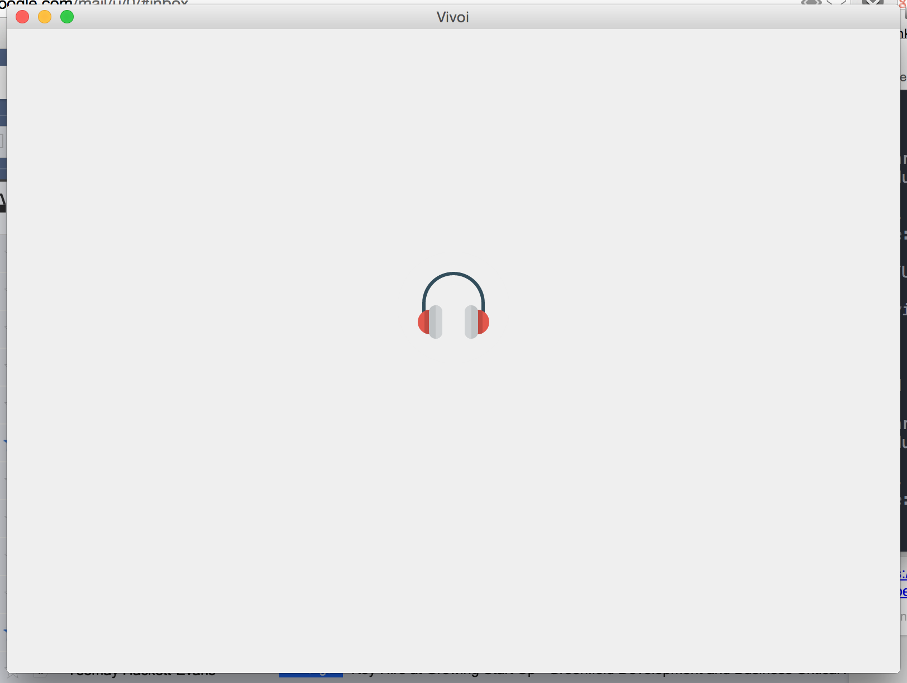
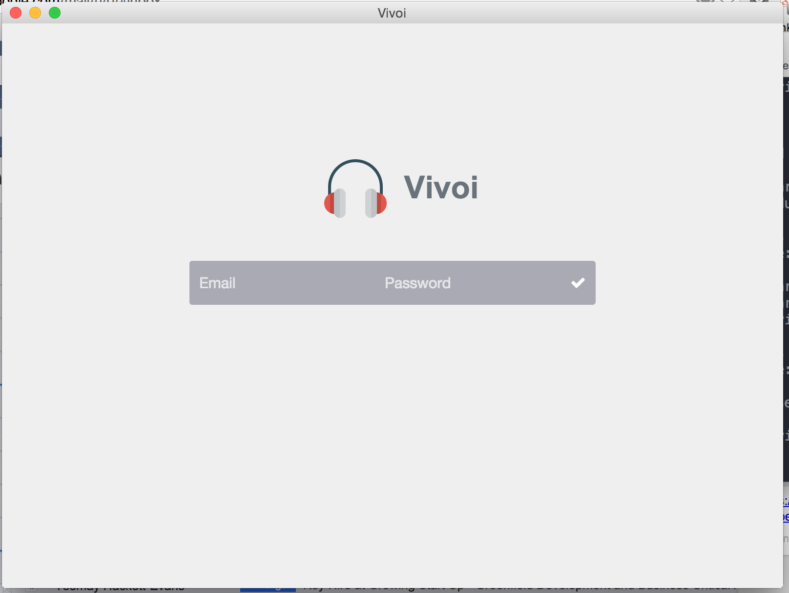
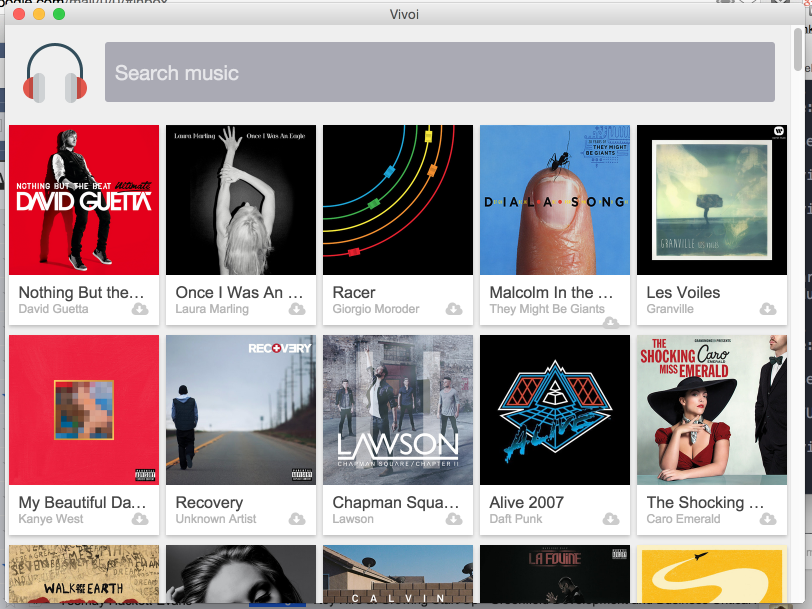

# Vivoi

Vivoi is a desktop Google Music manager. It's currently running only on Atom-Shell. I will work on a Google Chrome packaged app and Firefox OS app.

I created it using:

- [ReactJS](http://facebook.github.io/react/) for managing the different components of the App
- [Flux](http://facebook.github.io/flux/) for architecturing the App
- [PlayMusic](https://github.com/jamon/playmusic) for the unofficial Google Play Music SDK
- [Atom-Shell](https://github.com/atom/atom-shell) for running the app in a NodeJS/Browser cross-platform environment

## Getting started
Run these commands in your terminal in the directory of the cloned repository:

```
npm install
```

If you don't have [Watchify](https://github.com/substack/watchify) and [Reactify](https://github.com/andreypopp/reactify) already installed, execute this command :
```
npm install -g gulp
```

And finally this command to have your automatic build:
```
npm run-script watch
```


## Launch the app

### Atom Shell
Just run Atom Shell from the root of your folder project.


## Screenshots


